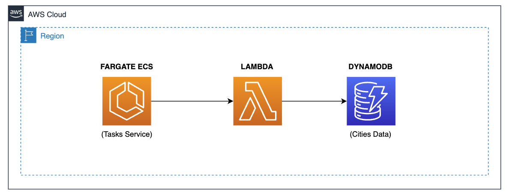

### Hiperium City Management.

* **Author**: [Andres Solorzano](https://www.linkedin.com/in/aosolorzano/).
* **Level**: 200 - Intermediate.
* **Technologies**: GraalVM with Java 21, Spring Boot 3, Spring Cloud 4, Spring Native, Spring Modulith, Docker, Testcontainers, LocalStack, Amazon DynamoDB, AWS Lambda, and AWS SAM.



---
### Description.
This project uses Spring Cloud Functions to create an AWS Lambda Function that returns basic data from a DynamoDB table.
You can read the following article on my Medium.com account to get more project details:

- [Using Spring Cloud AWS in Lambda functions to automate SDK client configurations](https://aosolorzano.medium.com/using-spring-cloud-aws-in-lambda-functions-to-automate-sdk-client-configurations-0e27c4beb588).

---
### Prerequisites.
- Git.
- AWS SAM CLI (version 1.112.+).
- GraalVM with OpenJDK (version 21.+). You can use SDKMAN.
- Docker Engine with the Compose Plugin (version 24.0.+).

---
### Project Structure.
The project is divided into the following files/directories:

- **functions**: Directory used back-end functions.
- **utils**: Directory used for script files and other project documentation.

---
### Internal project folders.
The internal project documentation is divided into the following directories:

- **functions/city-data-function**: Contains a Lambda function that returns basic data from a DynamoDB table.

---
### GraalVM Tracing Agent.
The Tracing Agent monitors our application’s behavior to see what classes, methods, and resources are being accessed dynamically. 
Then, it outputs configuration files that describe this dynamic behavior. 
These config files can be provided to the native-image utility when building a native image. 
The utility will read these files and include the necessary classes, methods, and resources in the native image, 
even though they aren’t referenced directly in our code:
    
```bash
./mvnw clean process-classes                  \
    -f functions/city-data-function/pom.xml   \
    -P tracing-agent
```

Then, copy the output files into the "META-INF/native-image" directory to be included by the native-image utility:
```bash
cp -r functions/city-data-function/target/native-image \
      functions/city-data-function/src/main/resources/META-INF/native-image
```

After this, you can build the native image using as usual and make tests with the AWS Lambda Function.

---
### Deployment Options.
So far, we have only one deployment option for the Lambda Function as this project is in development.
This option is using SAM CLI to deploy the Lambda Function to AWS.
You can execute the following script to show you the deployment options:
```bash
./start.sh
```

Select the default option to deploy the Lambda Function to AWS.

---
### Maven Parent overrides

Due to Maven's design, elements are inherited from the parent POM to the project POM.
While most of the inheritance is fine, it also inherits unwanted elements like `<license>` and `<developers>` from the parent.
To prevent this, the project POM contains empty overrides for these elements.
If you manually switch to a different parent and actually want the inheritance, you need to remove those overrides.
